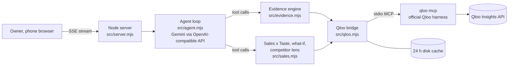

# TasteMenu

**Know what your diners love.** TasteMenu is a taste strategist for independent restaurants. An owner describes their place in one sentence. TasteMenu reads what people who eat at places like theirs also love (films, shows, music, brands, nearby places) using Qloo's taste graph, then turns that into this month's plan and the ready-to-send material to act on it.

**Live demo:** https://tastemenu-1037019152152.asia-south1.run.app (no login; tap a sample restaurant to start)

Built for the [Qloo Agentic Hackathon](https://qloo.devpost.com/).

---

## The problem

Big chains pay agencies to understand their customers. A neighbourhood restaurant (a darshini in Bengaluru, a trattoria in the West Village) has no such help. Generic marketing advice ("play soft music", "run a weekend special") is the same for every restaurant, because it knows nothing about the people who actually eat there.

Qloo knows what audiences love across domains. TasteMenu uses that to answer the owner's real questions: *what should I put on the menu, what should I play, what event should I run, who should I partner with, and which of my dishes should I push or drop?*

## What it does

| Feature | What the owner gets | Qloo tools behind it |
|---|---|---|
| **Your crowd** | The places most like yours in your city, and the films, shows, music artists and brands their audience over-indexes on, with Qloo affinity scores and an age/gender lean | `find_tags`, `recommend`, `audience_demographics` |
| **This month's plan** | Four concrete actions: a menu idea, music, an event and a partner cross-promotion. Each one cites the Qloo results it is built on, with a "watch out" note when a signal looks off | Agent over the evidence above + `entity_tags` |
| **Ready-to-send kit** | For every action: a WhatsApp broadcast in English and the city's local language (Kannada in Bengaluru, Spanish in New York, ...), an Instagram caption, specials-board text, a staff briefing, a partner outreach message and a checklist | — (written from the plan) |
| **Poster** | A ready-to-post 1080 × 1350 poster for the menu and event actions, with the headline in English and in the local language's own script (Kannada, Tamil, Hindi, ...), drawn in the browser; download or share straight to WhatsApp or Instagram | — (from the kit) |
| **Crowd playlist** | The music action comes with the artists this crowd loves, ranked by Qloo affinity, each one tap away on YouTube Music or Spotify | `recommend` (artists for the peer places' audience) |
| **Your menu vs your crowd** | Upload last month's item-wise sales (Petpooja or any POS CSV), or use the built-in sample month. Each dish is matched to a Qloo dish tag and scored for crowd fit, then sorted into *Double down*, *Reposition*, *Rethink*, *Core staple* or *Keep*, plus new dishes the crowd's favourite places are known for | `find_tags`, `recommend` (with the restaurant's peer places as taste signals), `entity_tags` |
| **What-if** | "Weekend biryani counter or a breakfast menu?" Ideas are scored for this crowd in one comparable run, with examples | `find_tags`, `recommend` |
| **Competitor lens** | "How is my crowd different from Vidyarthi Bhavan's?" Taste traits only places like yours have, only the competitor has, and both share | `describe`, `compare_audiences` |
| **Generic chatbot vs TasteMenu** | The same model answers the same question with no Qloo data, shown side by side ("0 real data points vs 13 Qloo signals"), so the difference Qloo makes is visible | — (baseline) |

### Trust rules built into the code

- **Every number on the board comes from Qloo.** When the plan is published, each evidence item is matched by name against the Qloo responses of that session (`verifyPlan` in `src/agent.mjs`). A matching item gets Qloo's own affinity value; a number Qloo did not return is removed; an unknown name is hidden.
- **No gap-filling.** If Qloo has no signal (no matching tag, competitor not found, empty comparison), the agent is instructed to say so instead of answering from general knowledge.
- **Aggregate, not personal.** Qloo results describe audience affinities, not individual customers, and the UI says so. Uploaded sales files stay in the session's memory and are never written to disk. Only the restaurant type and area are sent to Qloo.

## How it works



1. **Agent loop** (`src/agent.mjs`). The model plans and calls tools: `gather_taste_evidence`, `analyze_sales`, `rank_ideas`, `compare_competitor`, the raw Qloo tools (`qloo_rank`, `qloo_recommend`, `qloo_describe`, `qloo_find_tags`, schemas taken live from the Qloo MCP server), and two publishing tools (`publish_taste_plan`, `publish_action_kit`) whose arguments are validated and streamed to the page. The run is pinned to one model so multi-step tool calls stay valid; if that model keeps failing (for example 503 "high demand"), the whole turn restarts on a backup model.
2. **Evidence engine** (`src/evidence.mjs`). Resolves the cuisine to a Qloo tag, finds the peer places in the city, then uses the top five peers as taste signals to get the films, shows, artists, brands and partner places their audience over-indexes on, plus what the peers are known for and the audience's demographics. Every call is recorded in a trace that the page shows under "How this plan was made".
3. **Sales x Taste** (`src/sales.mjs`). Parses most POS item-wise exports (finds the item, quantity and amount columns by name, sums daily rows, skips totals). Crowd fit for a dish is the average Qloo affinity, for this restaurant's audience, of the top places in the city known for that dish's tag. Thin dish tags fall back to broader ones ("Biryani" → "Biryani restaurant"). Tiers are relative within the menu.
4. **Qloo bridge** (`src/qloo.mjs`). Starts the official `qloo mcp` server once over stdio, serialises calls with a small gap, retries 429s and retryable errors with backoff, and caches successful envelopes for 24 hours. `/api/warm` pre-fills the cache for the sample restaurants.

## Run it yourself

Requirements: Node.js 22.19+, a Qloo hackathon API key, and a Gemini API key (an OpenRouter key works as a backup).

```bash
npm install --global @qloo/qloo-harness@0.1.26
git clone https://github.com/Ankith-m1006/tastemenu.git
cd tastemenu
npm ci
cp .env.example .env        # then fill in the keys
npm start                   # http://localhost:4200
```

`npm run probe` checks the Qloo connection (lists the MCP tools and runs one tag search).

### Deploy (Google Cloud Run)

```bash
gcloud run deploy tastemenu --source . --region asia-south1 \
  --set-secrets QLOO_API_KEY=qloo-api-key:latest,GEMINI_API_KEY=gemini-api-key:latest,OPENROUTER_API_KEY=openrouter-api-key:latest
```

The Dockerfile installs the Qloo harness and points it at `https://hackathon.api.qloo.com`.

### Configuration

| Variable | Purpose |
|---|---|
| `QLOO_API_KEY` | Qloo hackathon key (read by the Qloo harness) |
| `QLOO_BASE_URL`, `QLOO_TRUSTED_BASE_URL` | `https://hackathon.api.qloo.com` |
| `GEMINI_API_KEY` | Main model |
| `OPENROUTER_API_KEY` | Optional backup model |
| `TASTEMENU_MODEL` | Override the main model (default `gemini-3.8-flash`) |
| `TASTEMENU_REASONING` | Model reasoning effort (default `low`; `default` to turn off) |
| `PORT` | Default 4200 locally, 8080 in the container |

## Project layout

```
src/server.mjs     HTTP server, SSE streaming, sessions, sales upload, cache warm-up
src/agent.mjs      agent loop, tools, plan verification, generic baseline
src/evidence.mjs   Qloo evidence engine
src/sales.mjs      Sales x Taste, what-if ranking, competitor lens
src/qloo.mjs       Qloo MCP bridge with queue, retries and cache
public/index.html  the whole front end (no build step)
data/sample-sales.csv  sample month for the demo restaurant
scripts/           connection and evidence probes for development
```

## Limitations

- Qloo coverage varies by city and dish. Where Qloo has no signal, TasteMenu says so instead of guessing.
- Affinity scores for one audience sit close together (often 0.95–0.99), so crowd-fit tiers and bars are relative within a menu or a list of ideas, not absolute.
- The sample sales month is illustrative data for a fictional restaurant, and it is labelled as sample data in the app.
- A cold run (a city and cuisine nobody has tried that day) takes about 30–50 seconds; the sample restaurants are pre-warmed.

## License

[MIT](LICENSE)
